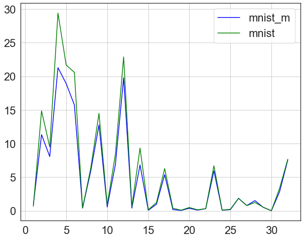
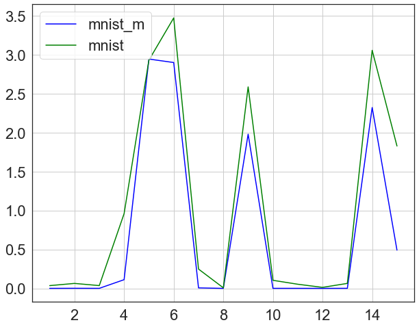
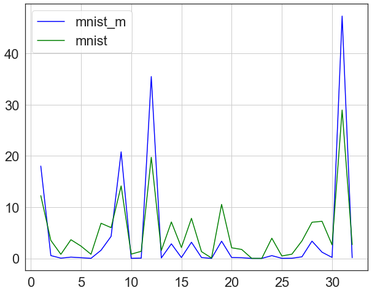
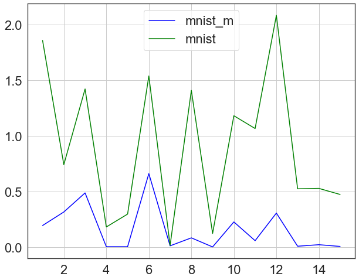

# MNIST VS MNISTM Domain Transfer

## Description
This is a repository to document all codes for the indepedent project MNIST VS MNISTM Domain Transfer colloborating with my friend @zhihanyang2022. 
This is an ongoing project and we are occassionally uploading files.
The experiments start with numbers are for Domain Adversarial Network.
The rest are for analysis of the CNN kernels.
The model can be found in exp3.py which contains feature extractor, classifier, and discriminator.

## Note
The codes in the notebooks are only viewable but not runable. One need to load their own data paths and MNIST/MNISTM data to load.

## Progress
We are currently working on traning only the MNIST model and use a pretrained Salient Object Detection model to transfer to any of MNIST-based domain.
So far, for a few of the data points the task is successful.

## Some results on a pretrained MNIST-M model classifying MNIST
### Train on MNISTM
#### Low-level feature

#### High-level feature

### Train on MNIST
#### Low-level feature

#### High-level feature

